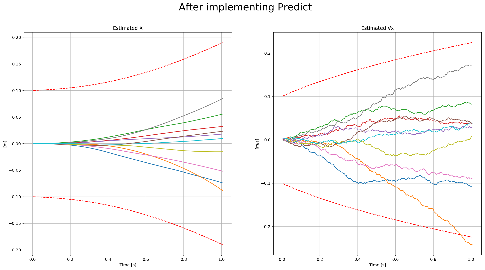

# FCND-Estimation-CPP-Solution
# Estimation Project

The last project of the [Flying Car Nanodegree - Term 1 - Aerial Robotics]. This project builds on top of the control project to get us closer to the reality: noise exists! Using an [Extended Kalman Filter(EKF)], we need to fusion noisy GPS, IMU and compass(magnetometer) to estimate current drone position, velocity, and yaw. The EKF is implemented using C++ with the code provided by Udacity on the [seed project](https://github.com/udacity/FCND-Estimation-CPP).

### Project Structure ###

For this project, you will be interacting with a few more files than before.

 - The EKF is already partially implemented for you in `QuadEstimatorEKF.cpp`

 - Parameters for tuning the EKF are in the parameter file `QuadEstimatorEKF.txt`

 - When you turn on various sensors (the scenarios configure them, e.g. `Quad.Sensors += SimIMU, SimMag, SimGPS`), additional sensor plots will become available to see what the simulated sensors measure.

 - The EKF implementation exposes both the estimated state and a number of additional variables. In particular:

   - `Quad.Est.E.X` is the error in estimated X position from true value.  More generally, the variables in `<vehicle>.Est.E.*` are relative errors, though some are combined errors (e.g. MaxEuler).

   - `Quad.Est.S.X` is the estimated standard deviation of the X state (that is, the square root of the appropriate diagonal variable in the covariance matrix). More generally, the variables in `<vehicle>.Est.S.*` are standard deviations calculated from the estimator state covariance matrix.

   - `Quad.Est.D` contains miscellaneous additional debug variables useful in diagnosing the filter. You may or might not find these useful but they were helpful to us in verifying the filter and may give you some ideas if you hit a block.

## The Tasks ##

Once again, you will be building up your estimator in pieces.  At each step, there will be a set of success criteria that will be displayed both in the plots and in the terminal output to help you along the way.

Project outline:

 - [Step 1: Sensor Noise](#step-1-sensor-noise)
 - [Step 2: Attitude Estimation](#step-2-attitude-estimation)
 - [Step 3: Prediction Step](#step-3-prediction-step)
 - [Step 4: Magnetometer Update](#step-4-magnetometer-update)
 - [Step 5: Closed Loop + GPS Update](#step-5-closed-loop--gps-update)
 - [Step 6: Adding Your Controller](#step-6-adding-your-controller)


### Step 1: Sensor Noise ###

#### Determine the standard deviation of the measurement noise of both GPS X data and Accelerometer X data. ####
The calculated standard deviation should correctly capture ~68% of the sensor measurements. Your writeup should describe the method used for determining the standard deviation given the simulated sensor measurements. 

- changes are reflected in [config/06_SensorNoise.txt](config/06_SensorNoise.txt)
- MeasuredStdDev_GPSPosXY = 0.67
- MeasuredStdDev_AccelXY = .49
- Config logs [config/log/Graph1.txt]and [config/log/Graph1.txt]
- [Standard deviation processor](./visualizations/Step%201%20Sensor%20Noise.ipynb)

```
- Run simulator using 06_NoisySensors.txt
- Collect Config logs
- Process standard deviation using collected files 
- Updated config/6_Sensornoise.txt with computed MeasuredStdDev_GPSPosXY and MeasuredStdDev_AccelXY
- Run the simulator using update 06_NoisySensors.txt, sensor mesurements should correctly capture ~68%
```


 Before                     |  After
 :-------------------------:|:-------------------------:
  |  

When the scenario is passing the test, you should see this line on the standard output:

```
PASS: ABS(Quad.GPS.X-Quad.Pos.X) was less than MeasuredStdDev_GPSPosXY for 67% of the time
PASS: ABS(Quad.IMU.AX-0.000000) was less than MeasuredStdDev_AccelXY for 49% of the time
```

The notebook used to calculate this values is [Step1 Sensor Noise](./visualizations/Step%201%20Sensor%20Noise.ipynb).

### Step 2: Attitude Estimation ###
#### Implement a better rate gyro attitude integration scheme in the UpdateFromIMU() function. ####
In this step, we need to include information from the IMU to the state. There is a few code provided by us there. The only thing we need to do is to integrate `pqr` from the gyroscope into the estimated pitch and roll. The implementation provided linear. The following figure illustrates the data we get with that implementation:

- changes are reflected in [src/QuadEstimatorEKF.cpp#L96-L108](src/QuadEstimatorEKF.cpp#L96-L108)

```
- Comment out predictedPitch ,predictedRoll and ekfState(6) to avoid integrating yaw twice
- Use quaternions as integration scheme to improve performance over current simple integration scheme
- Though not Euler angles, Quaternion has IntegrateBodyRate to use.
- Compute predictedPitch, predictedRoll and ekfState(6) using Quaternion Roll, Pitch and Yaw
```
<p align="center">
  
</p>


When the scenario is passing the test, you should see this line on the standard output:

```
PASS: ABS(Quad.Est.E.MaxEuler) was less than 0.100000 for at least 3.000000 seconds
```


### Step 3: Prediction Step ###
#### Implement all of the elements of the prediction step for the estimator. ####
This step has two parts. In the first part, we predict the state based on the acceleration measurement. Without modifying the code, we have this data; The second part we update the covariance matrix and finish the EKF state using the equations on the Estimation for Quadrotors paper provided by Udacity. 

- changes are reflected for PredictState in [PredictState](./src/QuadEstimatorEKF.cpp#L173-L192)
- changes are reflected for GetRbgPrime in [GetRbgPrime](./src/QuadEstimatorEKF.cpp#L216-L234)
- changes are reflected for Predict in [Predict](./src/QuadEstimatorEKF.cpp#L277-L291)
- changes are reflected for Covariance in [QuadEstimatorEKF](./src/QuadEstimatorEKF.cpp#L289)
- 
- 
- 
- 
- 

PredictState                     |  PredictCovariance
 :-------------------------:|:-------------------------:
  |  
 




### Step 4: Magnetometer Update ###
#### Implement the magnetometer update. ####
The update should properly include the magnetometer data into the state. Note that the solution should make sure to correctly measure the angle error between the current state and the magnetometer value (error should be the short way around, not the long way). 

- changes are reflected in [src/QuadEstimatorEKF.cpp#L342-L361](./src/QuadEstimatorEKF.cpp#L342-L361)

<p align="center">
  
</p>

```
PASS: ABS(Quad.Est.E.Yaw) was less than 0.120000 for at least 10.000000 seconds
PASS: ABS(Quad.Est.E.Yaw-0.000000) was less than Quad.Est.S.Yaw for 67% of the time
```


### Step 5: Closed Loop + GPS Update ###
#### Implement the GPS update. ####
The estimator should correctly incorporate the GPS information to update the current state estimate. 

- changes are reflected in [src/QuadEstimatorEKF.cpp#L313-L323](./src/QuadEstimatorEKF.cpp#L313-L323)
- changes are reflected in [GPS.txt](./visualizations/data)
- Quad.UseIdealEstimator = 0
- #SimIMU.AccelStd = 0,0,0
- #SimIMU.GyroStd = 0,0,0

<p align="center">
  
</p>


<p align="center">
  
</p>


```
PASS: ABS(Quad.Est.E.Pos) was less than 1.000000 for at least 20.000000 seconds
```


### Step 6: Adding Your Controller

#### De-tune your controller to successfully fly the final desired box trajectory with your estimator and realistic sensors. ####
The last step! You need to put the control and parameters from the last project and see how it behaves in a noisy scenario. I was lucky enough not to have to tune the control again. I guess the control parameters were "relaxed" already. After adding both files, we received this data:

- Updated to control Yaw in [src/QuadControl.cpp#L273-L287](./src/QuadControl.cpp#L273-L287)
- Updated to control Laterial position in [src/QuadControl.cpp#L234-L254](./src/QuadControl.cpp#L234-L254)


###### Before Detuning of Controller ######
<p align="center">
  
</p>

###### Magnetometer After Detuning of Controller ######
<p align="center">
  
</p>

###### GPS After Detuning of Controller ######
<p align="center">
  
</p>

MonteCarloTest                     |  TestManyQuads
 :-------------------------:|:-------------------------:
  |  


